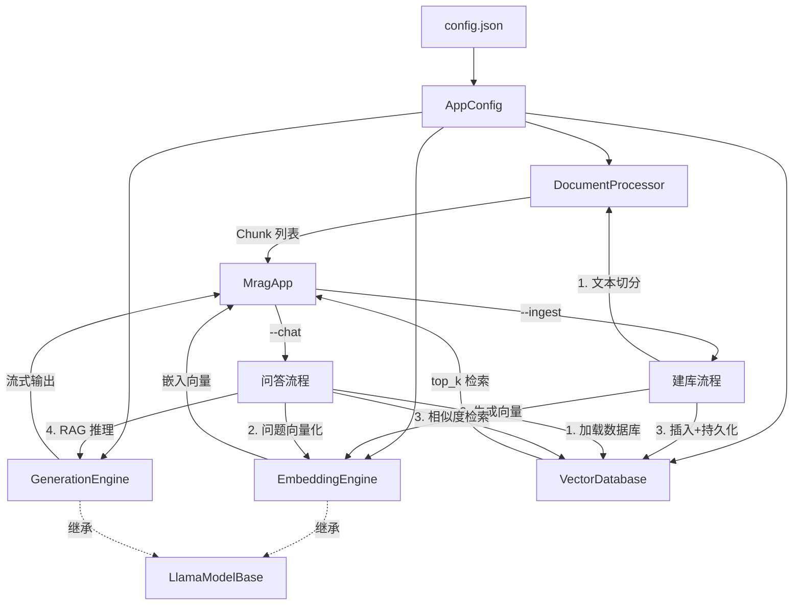

# MRAG 设计说明文档

## 一、系统架构

### 1.1 整体架构图



### 1.2 数据流说明

**建库流程（`--ingest`）：**

1. `DocumentProcessor` 读取 TXT 文件，识别章节标题，按 `chunk_size` / `overlap_size` 切分为 Chunk 列表
2. 逐 Chunk 送入 `EmbeddingEngine`，通过 Embedding 模型生成固定维度向量
3. 所有 Chunk（含向量）插入 `VectorDatabase`，二进制序列化写入磁盘

**问答流程（`--chat`）：**

1. 从磁盘加载 `VectorDatabase`
2. 用户问题送入 `EmbeddingEngine` 生成查询向量
3. 在 `VectorDatabase` 中以余弦相似度 + 最小堆检索 top-k 个最相关 Chunk
4. 检索结果与问题组装为 ChatML 格式 Prompt，送入 `GenerationEngine` 流式生成回答

---

## 二、模块设计详述

### 2.1 配置管理（`config.h` / `config.cc`）

**类名：** `AppConfig`（struct）

**职责：** 从 JSON 配置文件加载运行参数，支持部分字段覆盖，缺失字段保留编译期默认值。

**设计要点：**

- 使用 `nlohmann/json` 解析，逐字段 `value(key, default)` 安全读取
- 构造函数接受文件路径，文件不存在时不报错，全部使用默认值
- 通过友元函数 `fromJson()` 解耦 JSON 解析逻辑与结构体定义
- 支持移动语义，以值形式在 `MragApp` 中存储，避免悬空引用

**关键字段分类：**

| 类别 | 字段 | 默认值 |
|------|------|--------|
| 模型路径 | `emb_model_path`, `gen_model_path` | `./models/bge-…`, `./models/qwen-…` |
| GPU | `n_gpu_layers` | `99`（全量 GPU） |
| 文档切分 | `chunk_size`, `overlap_size` | `500`, `50` |
| 检索 | `top_k` | `3` |
| 生成上下文 | `gen_n_ctx`, `gen_n_batch`, `gen_n_ubatch`, `max_output_tokens` | `4096`, `4096`, `512`, `512` |
| 采样 | `temperature`, `top_k_sampler`, `top_p` | `0.7`, `40`, `0.9` |
| 嵌入上下文 | `emb_n_ctx`, `emb_n_batch`, `emb_n_ubatch` | `512`, `512`, `512` |

---

### 2.2 数据结构（`chunk.h` / `chunk.cc`）

**类名：** `Chunk`（struct）

**职责：** 定义最小文本单元，支持二进制序列化以保证跨平台持久化。

**字段定义：**

| 字段 | 类型 | 说明 |
|------|------|------|
| `id` | `uint64_t` | 全局唯一递增 ID（静态计数器） |
| `text` | `std::string` | 文本内容 |
| `metadata` | `std::string` | 所属章节名 |
| `embedding` | `std::vector<float>` | 嵌入向量（建库阶段填充） |

**序列化格式（二进制）：**

```
[id:8B] [text_len:8B] [text:var] [meta_len:8B] [metadata:var] [emb_dim:8B] [embedding:emb_dim×4B]
```

所有长度字段统一为 `uint64_t`，保证 32/64 位平台兼容。`serialize()` 写入 `std::ofstream`，`deserialize()` 为静态工厂方法从 `std::ifstream` 读取并返回新对象。

---

### 2.3 文档处理（`document.h` / `document.cc`）

**类名：** `Document`（struct）、`DocumentProcessor`（class）

**职责：** 读取 UTF-8 编码 TXT 文件，识别章节结构，按配置参数切分为 Chunk 列表。

**Document 设计：**

- `loadNovel(filepath)`：逐行读取，清除 `\r` 换行符，拼接为完整字符串 `full_text_`
- `matchChapterTitle()`：用正则`((^第[零一二三四五六七八九十百\d]+[章节回卷][　\s：]|Chapter\s+\d+).*?)\n`匹配章节标题，构建 `chapter_table_`（标题 → 起始位置 的映射）
- `locateChapter(pos)`：二分查找定位任意字符位置所属章节，返回章节名作为 Chunk 的 metadata

**DocumentProcessor 设计：**

- 持有 `std::vector<Document>`，支持多文档导入（`addNovel()`）
- `processNovel()` 核心流程：
  1. 对每个 Document 调用 `matchChapterTitle()`
  2. 以 `chunk_size` 为窗口滑动，调用 `nextUtf8Boundary()` 确保切割点在合法 UTF-8 边界
  3. 调用 `semanticJust()` 将切割窗口首尾对齐到句末标点（`。！？`）或换行符
  4. 窗口前移时保留 `overlap_size` 字节重叠
  5. 文件末尾残余文本（不足阈值）作为最后一个 Chunk

**UTF-8 辅助函数：**

- `nextUtf8Boundary(text, pos)`：检查 `pos` 处是否落在 UTF-8 后续字节（`10xxxxxx`）上，若是则向后滑动至下一个合法首字节
- `semanticJust(text, start, end)`：在切割窗口内查找最近的句末标点或换行符，将 `start`（向前）和 `end`（向后）对齐到语义边界，避免截断句子

---

### 2.4 向量数据库（`vectordatabase.h` / `vectordatabase.cc`）

**类名：** `VectorDatabase`

**职责：** 存储 Chunk 集合，提供余弦相似度检索和二进制持久化。

**核心实现：**

- **存储结构：** `std::vector<Chunk> chunks_`，内存全量存储
- **检索算法：** 使用 `std::priority_queue`（最小堆）实现 O(n log k) 的 top-k 检索。将余弦相似度预计算为 `Node{score, idx}`，每个 Chunk 只计算一次相似度，避免比较器中的重复计算
- **文件格式：**

```
[魔数:4B] [版本号长度:8B] [版本号字符串:var] [Chunk总数:8B] [Chunk序列化数据...]
```

魔数值 `0x4D524147`（ASCII: "MRAG"），版本号 `"v1.0.0"`。加载时校验两者，不匹配则拒绝加载并返回 `false`。

**余弦相似度：**

```
cosine(A, B) = (A·B) / (||A|| × ||B||)
```

独立函数 `cosine(v1, v2)`，包含零向量保护和维度不匹配检测。

---

### 2.5 模型基类（`llamamodel.h` / `llamamodel.cc`）

**类名：** `LlamaModelBase`

**职责：** 以 RAII 原则管理 `llama_model*` 和 `llama_context*` 的完整生命周期。

**设计要点：**

- **构造函数重载：**
  - `LlamaModelBase(ModelType, AppConfig)`：根据 `ModelType` 枚举（`Embedding` / `Generation`）选择加载逻辑
  - Embedding 模式：`ctx_params.embeddings = true`，`pooling_type = LLAMA_POOLING_TYPE_MEAN`
  - Generation 模式：`ctx_params.embeddings = false`
- **析构顺序：** 先 `llama_free(context_)`，再 `llama_model_free(model_)`，与 llama.cpp 要求的释放顺序一致
- **禁用拷贝，支持移动：** 移动构造/赋值将源对象指针置 `nullptr`，析构时判空避免 double-free
- **`tokenize()`（protected）：** 两次调用 `llama_tokenize`——第一次传入 `nullptr` 探测所需空间，第二次写入实际 token 数组

---

### 2.6 向量引擎（`embeddingengine.h` / `embeddingengine.cc`）

**类名：** `EmbeddingEngine`（继承 `LlamaModelBase`）

**职责：** 调用 Embedding 模型将文本转换为固定维度浮点向量。

**推理流程（`generateEmbeddings(text)`）：**

1. `sanitizeUtf8(text)`：扫描并截断末尾残缺的 UTF-8 序列（如被截断的多字节字符）
2. `tokenize()` 分词，截断至 `min(n_ctx, n_batch)` 上限
3. `llama_memory_clear()` 清空 KV Cache，防止上下文污染
4. 手动构造 `llama_batch`，填充 token、position、seq_id，仅最后一个 token 开启 `logits`
5. `llama_encode()` 执行编码（Embedding 模型使用 encode 而非 decode）
6. 优先 `llama_get_embeddings_seq(ctx, 0)` 获取序列级池化向量，失败回退 `llama_get_embeddings(ctx)`
7. 返回长度为 `llama_model_n_embd(model_)` 的 `vector<float>`（BGE-Small 为 512 维）

**模型热切换（`reset(config)`）：**

创建临时 `EmbeddingEngine` 加载新模型，成功后释放旧资源，通过移动赋值接管新对象。若加载失败则保持旧模型不变。

---

### 2.7 生成引擎（`generationengine.h` / `generationengine.cc`）

**类名：** `GenerationEngine`（继承 `LlamaModelBase`）

**职责：** 将检索到的上下文与用户问题组装为 ChatML Prompt，通过生成模型流式输出回答。

**推理流程（`generateStream(query, chunks)`）：**

1. **清空 KV Cache：** `llama_memory_clear()`
2. **构建上下文：** 将 chunks 格式化为 `[来源: 章节名] 文本内容` 拼接字符串
3. **组装 ChatML Prompt：**
   ```
   <|im_start|>system
   你是一个严谨的小说阅读助手...<|im_end|>
   <|im_start|>user
   [参考上下文]：{context}
   用户问题：{query}<|im_end|>
   <|im_start|>assistant
   ```
4. **Prompt Prefill：** 将全部 prompt tokens 装入 batch，仅最后一个 token 开启 `logits`，调用 `llama_decode()`
5. **初始化采样链**（顺序不可颠倒）：
   ```
   top_k → top_p → temperature → dist
   ```
6. **自回归生成循环（最多 `max_output_tokens` 次）：**
   - `llama_sampler_sample()` 采样下一个 token
   - `llama_vocab_is_eog()` 检测结束标记，命中则退出
   - `tokenToString()` 将 token ID 转为字符串，`std::cout << std::flush` 实现打字机效果
   - 清空 batch，填入新 token（`n_tokens=1`，position 递增），`llama_decode()` 更新 KV Cache
7. **释放资源：** `llama_sampler_free()` + `llama_batch_free()`

**tokenToString 实现：**

两次调用 `llama_token_to_piece`：第一次传入空 buffer 探测所需长度，第二次写入实际数据。保留前导空格（`lstrip=0`），不渲染特殊 token。

---

### 2.8 应用主体（`mragapp.h` / `mragapp.cc`）

**类名：** `MragApp`

**职责：** 持有所有模块实例，协调建库与问答两大流程，提供热切换接口。

**成员声明顺序（关键设计）：**

```cpp
BackendGuard backendguard_;   // 第一个成员 — 构造时调用 llama_backend_init()
AppConfig config_;            // 值存储，避免悬空引用
EmbeddingEngine emb_;         // 继承 LlamaModelBase
GenerationEngine gen_;        // 继承 LlamaModelBase
VectorDatabase db_;
DocumentProcessor docu_processor_;
```

`BackendGuard` 在成员列表最前声明，利用 C++ 成员按声明顺序初始化的规则，保证 `llama_backend_init()` 先于所有引擎构造，`llama_backend_free()` 后于所有引擎析构。其构造/析构函数中注册空日志回调屏蔽 llama.cpp 底层输出。

**核心方法：**

| 方法 | 功能 |
|------|------|
| `buildKnowledgeBase(txt, db)` | 切分 → 逐块嵌入 → 插入数据库 → 持久化 |
| `chatLoop()` | 加载数据库 → 循环读取问题 → 嵌入 → 检索 → 生成 |
| `switchConfig(path)` | 备份旧配置，尝试加载新配置，按需切换模型，失败回滚 |
| `resetEmbedding(path)` / `resetGeneration(path)` | 运行时热切换单一模型 |

**chatLoop 内置命令：**

解析以 `/` 开头的用户输入，支持 `/model -g/-e`、`/config`、`/help`、`/exit` 等指令，实现在不退出程序的情况下切换模型或配置。

---

### 2.9 程序入口（`main.cc`）

**CLI 解析：** `parseCli(argc, argv)` 返回 `vector<string>`，长度 0 表示参数错误，1 表示 chat 模式，>1 表示 ingest 模式。

**运行模式：**

```bash
./mrag --ingest <txt1> [txt2 ...] <db_path>   # 离线建库
./mrag --chat <db_path>                        # 在线问答
```

**异常处理：** 顶层 try-catch 捕获 `std::exception` 和未知异常，输出可读错误信息后退出。

---

## 三、类继承关系

```
LlamaModelBase (RAII 管理 llama_model* / llama_context*)
    ├── EmbeddingEngine  (文本 → 向量)
    └── GenerationEngine (RAG 推理 + 流式输出)

BackendGuard (RAII 管理 llama_backend_init / free)
    └── 作为 MragApp 第一个成员，保证生命周期包裹所有引擎
```

---

## 四、关键设计决策

### 4.1 RAII

所有 llama.cpp C API 资源（`llama_model*`、`llama_context*`、`llama_batch`、`llama_sampler*`）均通过 C++ 类/RAII 管理，无裸露 `new`/`delete`。`LlamaModelBase` 禁用拷贝、支持移动，析构函数严格按 `context_` → `model_` 的顺序释放。

### 4.2 移动语义 + 值存储

`AppConfig` 以值形式存储在 `MragApp` 中，避免引用悬挂。配置热切换时通过 `std::move` 备份旧配置，加载失败则移动回滚。

### 4.3 最小堆检索优化

向量检索的 lambda 比较器版本会每次比较都重新计算余弦相似度（O(n log k × 2)），优化后的 `Node{score, idx}` 版本每个 Chunk 只计算一次相似度，比较时直接比较预存分数。

### 4.4 两次调用模式

`tokenize()` 和 `tokenToString()` 均采用"先探测长度，再分配写入"的两阶段模式——第一次调用传入空/零参数获取所需空间，第二次传入预分配缓冲区写入数据。这是 llama.cpp C API 的标准使用范式。

### 4.5 UTF-8 安全性

所有文本切割操作通过 `nextUtf8Boundary()` 保证不截断多字节字符；`sanitizeUtf8()` 在嵌入前清理输入末尾的残缺序列；`semanticJust()` 在语义标点处微调切割边界。

## 五. 已知问题与局限性

1. **C++ 标准版本较高：** 项目使用了 C++23 特性（如 `std::println`、`std::ranges` 等），需要较新版本的编译器（GCC 13+），在老版本 Linux 发行版上可能无法直接编译。
2. **单线程处理：** 建库阶段逐块生成嵌入向量为串行处理，大量文本建库时耗时较长。
3. **仅支持 TXT 格式：** 当前文档处理模块仅支持 UTF-8 编码的纯文本小说，不支持 PDF、DOCX、HTML 等格式。
